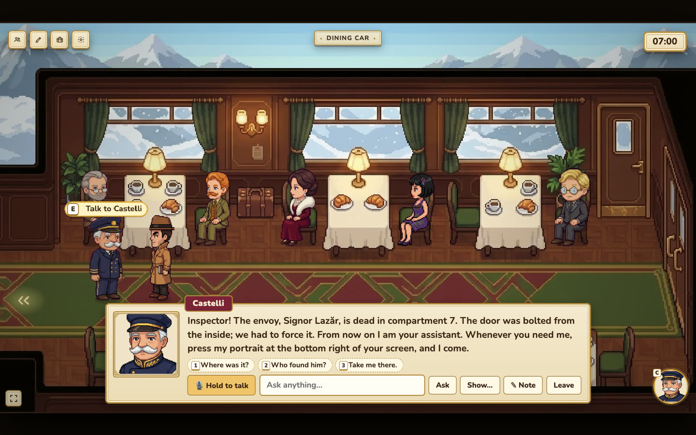

# 🔎 Last Alibi

**A live-voice detective game where you interrogate AI agents to uncover a truth that never changes.**

## What is it?

**Last Alibi** is an investigation game built around AI agents.

In the story playable today, a murder has taken place in **1931 aboard a train stranded by snow in the Alps**. You are the inspector.

Walk around the train, search for clues, and **speak directly to every character using your voice**. There are no dialogue trees: ask anything, bluff, pressure suspects, confront them with testimony, or catch them contradicting themselves.

Every interrogation can unfold differently.

**The characters improvise. The truth doesn't.**

## How do you win?

Your objective is to:

**Explore → Collect clues → Question suspects → Find contradictions → Build your case → Accuse**

To solve the case, identify:

- the **killer**
- the **motive**
- at least **three pieces of proof**

Confront the right suspect with enough evidence and they crack and confess.

## Why AI Agents?

Every character behaves as an **AI agent**, with their own:

- identity and personality
- knowledge and secrets
- relationships
- memories
- alibi
- goals and constraints

The agents can improvise how they answer, but the underlying mystery remains grounded in a shared world state: who did what, where everyone was, what they witnessed, what evidence exists, and what each character is allowed to know.

This lets us combine:

**Open-ended AI conversation + a consistent, solvable mystery.**

Conversations can also become gameplay. If one character says:

> “I saw the Doctor in the dining car at 10:15.”

while the Doctor claims:

> “I was in my cabin at 10:15.”

that creates a contradiction the player can investigate and eventually use as evidence.

## Castelli — Your AI Partner

Castelli is not just another NPC. He is an **agent you can delegate tasks to**.

Tell him:

> “Search the Doctor's room.”  
> “Bring Anna here.”  
> “Go question the conductor.”  
> “Help me make sense of the case.”

He performs actions in the world and reports back, letting the player investigate alongside an AI partner.

## Built With

**Google Gemini** — reasoning, dialogue and improvisation for the character agents.

**Gradium** — live voice interaction: characters hear the player and respond with their own voices in real time.

**People Cognition** — persistent understanding of people, relationships, memories and testimony across an investigation.

Together, they let us turn natural conversation into an actual game mechanic rather than simply putting a chatbot inside a game.

📚 **Documentation of all APIs, frameworks & tools used:** [docs/stack.md](docs/stack.md)

## With More Time

We would turn Last Alibi into an episodic investigation platform:

- **A new story every month** through a subscription, or individual story packs to buy.
- A **community where players pitch mystery ideas**, including stories inspired by current events, such as the Louvre jewel heist, and vote for the next month's investigation.
- A **premium duo pass**, letting two detectives investigate the same case together, split up, interrogate different suspects, and combine their evidence.

The same agent engine could power murders, disappearances, thefts, espionage and entirely new mystery worlds.

### In one sentence

**Last Alibi is a detective game where you interrogate autonomous AI agents with your real voice, delegate investigations to them, and uncover one consistent truth through conversations that can unfold in infinitely different ways.**
